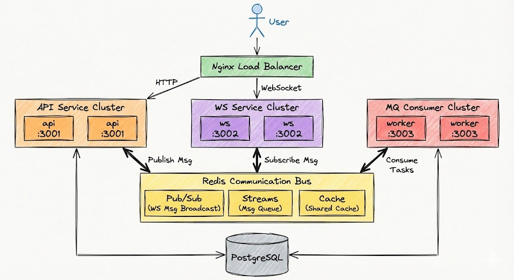

# Crab Framework

A modular Go web framework with clean layered architecture. Run as monolith or split modules into separate services from the same codebase.

English | [简体中文](README_CN.md)

## Architecture



## Features

- ✅ **Modular Architecture** - Clean layered design with dependency inversion
- ✅ **Multi-Database Support** - Multiple PostgreSQL and Redis instances
- ✅ **Module Dependency Management** - Automatic validation with strict/lenient modes
- ✅ **Unified Logging System** - Colored console output + module-specific log files
- ✅ **Error Management** - Comprehensive error code system
- ✅ **Performance Optimized** - String conversion cache, connection pooling
- ✅ **Bilingual Comments** - English + Chinese code documentation
- ✅ **Flexible Deployment** - Monolith or microservices from same codebase
- ✅ **Hot Reload** - Config hot-reload with encryption support
- ✅ **Comprehensive Testing** - 40+ unit tests with good coverage

## Quick Start

```bash
go run . init              # Generate config file
go run . serve             # Start all modules
go run . serve -s api      # Start by service name
go run . serve -m testapi  # Start by module name
go run . list              # List modules and services
go run . deps              # Show module dependencies
```

## Project Structure

```
├── main.go
├── boot/                   # Bootstrap layer
│   ├── boot.go            # Lifecycle management
│   ├── cmd.go             # CLI commands
│   └── context.go         # Module context
├── common/                 # Shared business layer
│   ├── config/            # Config management
│   ├── middleware/        # HTTP middlewares
│   ├── response/          # Response structures
│   ├── service/           # Shared services
│   └── util/              # Shared utilities
├── pkg/                    # Infrastructure layer (no business dependencies)
│   ├── cache/             # Cache abstraction (Redis/Local)
│   ├── config/            # Config loader (TOML + hot-reload + encryption)
│   ├── cron/              # Cron job scheduler
│   ├── jwt/               # JWT authentication
│   ├── logger/            # Structured logging (per-module files)
│   ├── metrics/           # Prometheus metrics
│   ├── mq/                # Message queue (Redis/RabbitMQ)
│   ├── pgsql/             # PostgreSQL (xorm)
│   ├── redis/             # Redis client
│   ├── server/            # HTTP server (Fiber)
│   ├── snowflake/         # Snowflake ID generator
│   ├── storage/           # Storage abstraction (Local/S3/OSS)
│   ├── trace/             # OpenTelemetry tracing
│   ├── util/              # Utility functions
│   └── ws/                # WebSocket hub
└── module/                 # Business modules
    ├── testapi/           # Example API module
    │   ├── module.go      # Module entry
    │   └── internal/      # Private implementation
    └── ws/                # WebSocket examples
        ├── module.go      # Module entry
        ├── example_01_basic/
        ├── example_02_multiuser/
        ├── example_03_callback/
        ├── example_04_cluster/
        └── example_05_service/
```

## Architecture Rules

| Rule | Description |
|------|-------------|
| pkg has no business dependencies | Can be used independently, each package has its own Config |
| common depends on pkg | Shared business layer |
| module depends on common + pkg | Business modules |
| with internal = private module | Internal implementation, not exported |

## Example Modules

### testapi - API Examples

Demonstrates basic HTTP handlers, message queue integration, and response formatting.

### ws - WebSocket Examples

Demonstrates various usages of `pkg/ws`, provided as reference examples only. See `module/ws/README.md` for details.

## Configuration

### Multi-Database Support

```toml
# config.toml
[app]
name = "crab"
env = "dev"
strict_dependency_check = true  # Validate module dependencies

# Multiple PostgreSQL databases
[database.default]
host = "localhost"
port = 5432
user = "postgres"
password = "ENC(xxxxx...)"  # Encrypted value
db_name = "crab"
auto_migrate = true
show_sql = false

[database.usercenter]
host = "localhost"
db_name = "crab_usercenter"
auto_migrate = true

# Multiple Redis instances
[redis.default]
addr = "localhost:6379"
password = ""
db = 0

[redis.cache]
addr = "localhost:6380"
db = 1

[[services]]
name = "api"
addr = ":3000"
modules = ["testapi", "ws"]
```

### Usage in Code

```go
// Database
pgsql.Get()              // Default database
pgsql.Get("usercenter")  // Named database

// Redis
redis.Get()              // Default Redis
redis.Get("cache")       // Named Redis instance
```

### Encrypt Sensitive Values

```bash
# Encrypt
go run . encrypt -k your-secret-key -v "password123"
# Output: ENC(xxxxx...)

# Start with decryption key
go run . serve -k your-secret-key
```

## Module Development

```go
// module/xxx/module.go
package xxx

import "server/boot"

func init() {
    boot.Register(&Module{})
}

type Module struct{}

func (m *Module) Name() string { return "xxx" }
func (m *Module) Models() []any { return nil }

func (m *Module) Init(ctx *boot.ModuleContext) error {
    // Setup routes
    ctx.Router.Get("/hello", func(c *fiber.Ctx) error {
        return c.JSON(fiber.Map{"msg": "hello"})
    })
    return nil
}

func (m *Module) Start() error { return nil }
func (m *Module) Stop() error { return nil }
```

**Important: Add import in main.go**

```go
// main.go
import (
    _ "server/module/xxx"  // Must add new module
)
```

## Infrastructure Packages

All packages in `pkg/` are independent and can be used in other projects:

- **cache** - Unified cache interface (Redis/Local)
- **config** - TOML config with hot-reload and encryption
- **cron** - Cron job scheduler
- **logger** - Structured logging with per-module files
- **metrics** - Prometheus metrics middleware
- **mq** - Message queue abstraction (Redis/RabbitMQ)
- **pgsql** - PostgreSQL with xorm
- **redis** - Redis client with connection pool
- **storage** - Storage abstraction (Local/S3/OSS)
- **ws** - WebSocket hub with pub/sub

## Multi-Service Deployment

```toml
# config.toml
[[services]]
name = "all"
addr = ":3000"
modules = ["testapi", "ws"]

[[services]]
name = "api"
addr = ":3001"
modules = ["testapi"]

[[services]]
name = "ws"
addr = ":3002"
modules = ["ws"]
```

```bash
go run . serve -s api  # Start API service only
go run . serve -s ws   # Start WebSocket service only
go run . serve -s all  # Start all modules
```

## Response Format

```json
{"code": 0, "msg": "success", "data": {...}}
{"code": 4001, "msg": "error message"}
```

## Logging

### Unified Logging System

All logs go through the unified logger with colored console output and module-specific files:

```go
import "server/pkg/logger"

var log = logger.NewWithName[struct{}]("module-name")

log.Info("message %s", arg)
log.Error("error %v", err)
log.InfoCtx(ctx, "message with traceId")
```

**Log Organization:**
- Request logs: `logs/{module}/date.log` (auto-detected from URL)
- SQL logs: `logs/sql/date.log` (all databases)
- System logs: `logs/system/date.log`

**Features:**
- Colored console output with module names
- Trace ID support for request tracking
- Status-based log levels (2xx/3xx=INFO, 4xx=WARN, 5xx=ERROR)
- Daily log rotation

## Error Handling

```go
import "server/common/errors"

// Create business errors
err := errors.New(4001, "user not found")
err := errors.Newf(4002, "invalid param: %s", param)

// Wrap errors
err := errors.Wrap(originalErr, 5001, "database error")

// Common errors
errors.ErrUnauthorized()    // 401
errors.ErrForbidden()       // 403
errors.ErrNotFound()        // 404
errors.ErrServerError()     // 500
```

## Performance Optimization

### String Conversion Cache

```go
import "server/pkg/util"

// Cached conversion for integers 0-10000 (3-5x faster)
str := strconv.Int64ToString(123)
ids := strconv.Int64ToStringBatch([]int64{1, 2, 3})
```

## License

MIT

## Acknowledgments

- [Kiro](https://kiro.dev) + [Claude](https://claude.ai) - Code assistance and architecture design
